# Nuclear Outages

---

Data pipeline + Web application that extracts, processes, stores, and shows
nuclear outages data from the EIA Open Data API.

## Prerequisites

---

The following steps are assumed when this project is executed locally:

* Dependencies listed in requirements.txt have been properly resolved.
* Root directory contains .env file with a valid API KEY from EIA Open Data API.
* EIA Open Data API is online and available for public consumption.
* The user has either an active internet connection (to fetch new data) or .DB file in ./data contains pre-filled content.

## Quick start

---

These are the steps to run this project locally for the first time:

1. Clone the repository.
2. Create a python virtual environment: `python -m venv .venv`
3. Install dependecies listed in requirements.txt.
4. Create .env file in root directory with a valid API KEY.
5. Run the app with an internet connection to fetch data from EIA Open Data API: `python app.py`

## API Key setup

---

In order to run this application you must provide a valid API KEY from EIA Open Data API.

These are the steps to do so:

1. Visit the [EIA Open Data](https://www.eia.gov/opendata/) website.
2. Follow the registering process to request an API KEY.
3. Create a .env file in the root directory.
4. Include API_KEY in .env file.

Example: `API_KEY=your_api_key`

## Tech stack

---

* **Python**
    * Flask - Backend, REST API & static file serving
    * Pandas - Data manipulation
    * PyArrow - Parquet manipulation
* **DuckDB** - Local analytical database (great for working directly with parquet files)
* **HTML / CSS / Javascript** - Frontend

## Data model

---

The data fetched from the government API is processed and cleaned to follow this model.

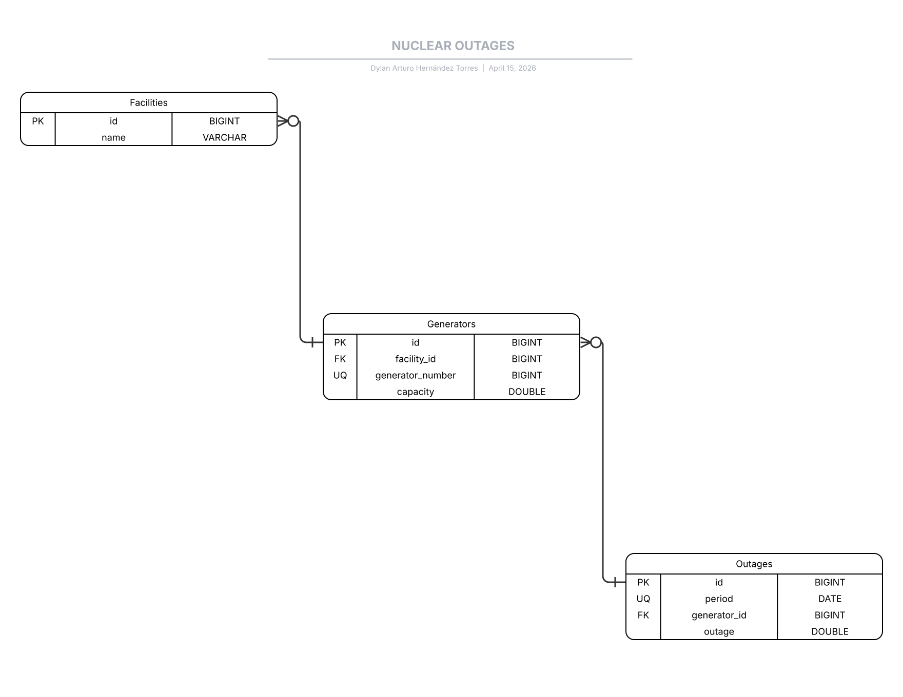

This is what makes it to the .parquet file and eventually .db file.

## Result examples

---
All of the data shown in the web app comes from .db file being served by Flask API.

### Refreshing

---

When you enter the main endpoint the refresh process in which the whole ETL_pipeline runs in order to either create and fill db from scratch, or keep data up to date since last time entered.

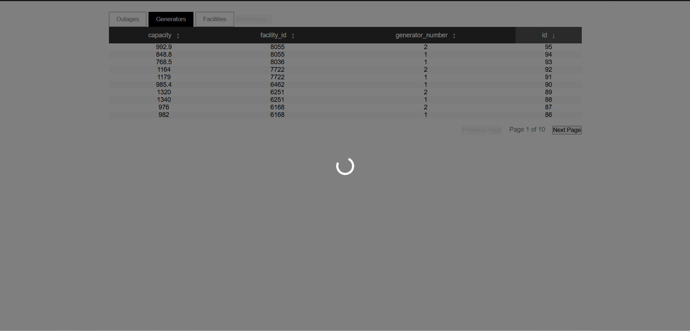

If the process fails for whatever reason, and there was no prior content in db, then no data is shown.
In another case the pipeline can error, but we have some data in DB, so only existing records are shown.

<table>
  <tr>
    <td>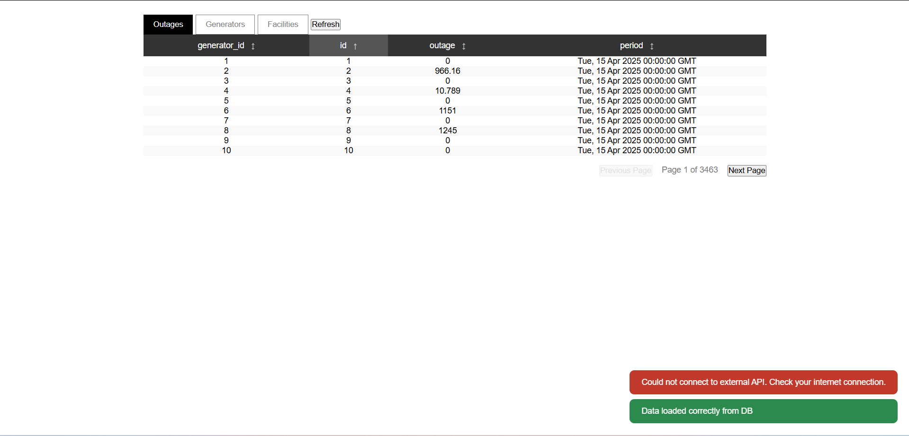</td>
    <td>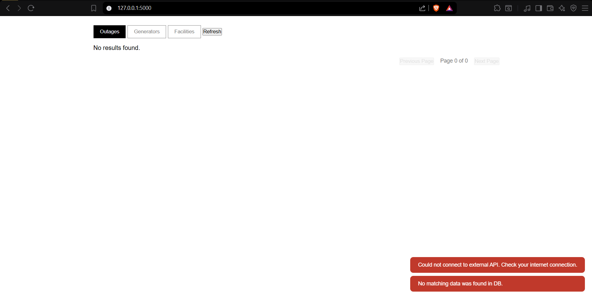</td>
  </tr>
</table>

Once data is retrieved from DB you can explore data from all three tables, facilities, for example:

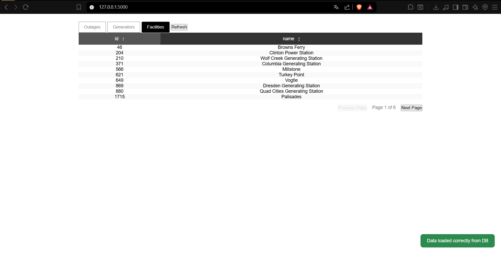

You can redo the process as many times as you wish by clicking the refresh button or reloading page.

### Sorting and ordering

---

By clicking a table header you send a request to the API to retrieve data sorted by that field. Clicking the same header again toggles between DESC and ASC ordering.

<table>
  <tr>
    <td>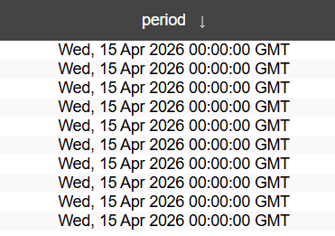</td>
    <td>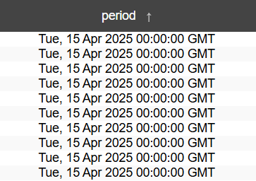</td>
  </tr>
</table>

### Filtering

---

Basic filtering is also supported by the web interface, but more complex calls can be made manually to the /data endpoint. The menus are accessed by clicking a table cell and a menu pops up.

The filters available in menu vary by data type. The types are:

* NUMBER
* DATE
* STRING

<table>
  <tr>
    <td>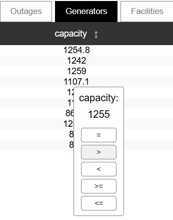</td>
    <td>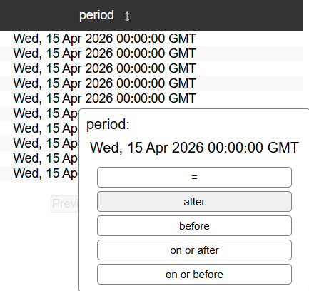</td>
    <td>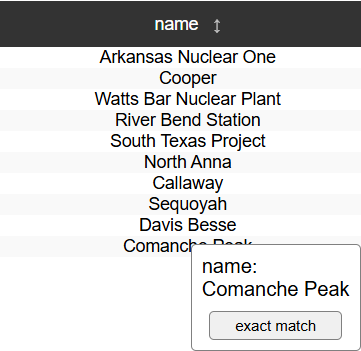</td>
  </tr>
</table>

Once a filter is selected another call is made and the data is displayed. If you wish to display the original table just click the same table's button again.

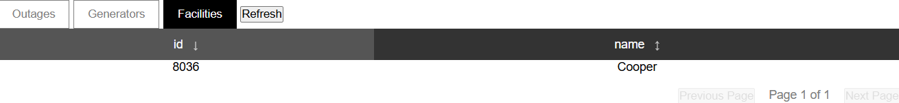

### Pagination

---

When records are displayed only a part of them is requested from API (10 by default). You can request further or prior pages by clicking the buttons below the right side of the table.

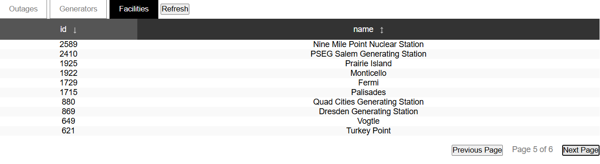

## Roadmap

---

Core functionality is complete. The following features are planned:

* Testing: 
    * Unit testing
    * Integration testing
    * E2E testing
* Containerization
* Support for more complex UI filtering
